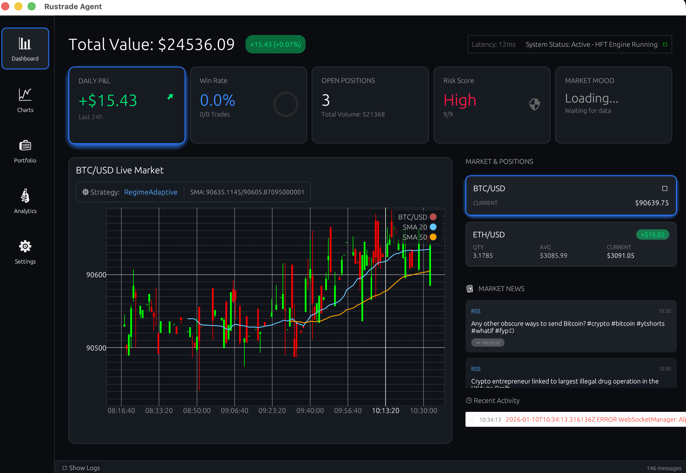
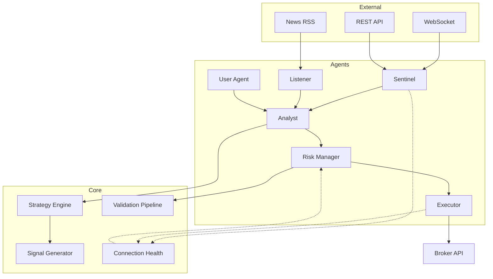

# RustTrade Agentic Bot 🦀

[](https://github.com/zuytan/rustrade/actions/workflows/ci.yml)
[](https://opensource.org/licenses/MIT)
[](https://www.rust-lang.org/)

> [!WARNING]
> **This project is not production-ready and should not be used with real money.**
> Using this trading bot involves significant financial risks. Use it only in simulation mode (Paper Trading) or for educational purposes.

A high-performance, multi-agent algorithmic trading system built in Rust. Capable of real-time market surveillance, trend analysis, and autonomous execution. Now featuring a full **Native Desktop Interface**.

## 📸 Screenshots

<p align="center">
  
</p>

## 🚀 Key Features

### 🧠 Intelligent Agents
- **Multi-Agent Architecture**: 6 specialized agents (Sentinel, Scanner, Analyst, Risk Manager, Order Throttler, Executor).
- **Regime Detection**: Automatically detects Bull, Bear, Sideways, and Volatile market regimes.
- **Dynamic Scanning**: Real-time discovery of "Top Movers" and volatility opportunities (Stocks & Crypto).
- **System Health Monitoring**: Centralized `ConnectionHealthService` that tracks physical connectivity and broadcasts status to all agents for safe execution.
- **Advanced Observability**: Full `tracing` instrumentation, custom Prometheus metrics (win rate, drawdown, latency), and structured logging.

### 🖥️ Native User Interface (New)
- **High-Performance Dashboard**: Built with `egui` (0.31) for zero-latency monitoring.
- **Real-Time Visuals**: Live charts, interactive metric cards, and scrolling activity feed.
- **Internationalization (i18n)**: Fully localized in **English** 🇬🇧 and **French** 🇫🇷.
- **Manual Control**: "Panic Button" and manual strategy overrides directly from the UI.

### 📈 Trading Strategies
- **Standard**: Dual SMA Crossover (Golden/Death Cross).
- **Advanced**: Triple Filter System (SMA Trend + RSI Momentum + MACD + **ADX Trend Strength**).
- **Dynamic**: Automatically switches strategies based on Market Regime (e.g., Trend Riding vs Mean Reversion).
- **Statistical**: Z-Score Mean Reversion & Statistical Momentum (Regression Slope).
- **Machine Learning**: Random Forest Classifier trained on technical features (`MLStrategy`).
- **Trend Riding**: Long-term trend following with trailing stops.
- **Mean Reversion**: Contrarian strategy for overbought/oversold conditions (BB + RSI).

### 🛡️ Advanced Risk Management
- **Correlation Filters**: Prevents exposure to highly correlated assets (Pearson matrix).
- **Sector Exposure Limits**: Caps risk per industry sector.
- **Circuit Breakers**: Daily Loss Limit, Max Drawdown Halt, Composite Risk Score.
- **Persistence ("No Amnesia")**: Retains critical risk state (HWM, Daily Loss) across restarts.
- **Panic Mode**: Blind emergency liquidation during data outages.
- **PDT Protection**: Pattern Day Trader safeguards for accounts < $25k.
- **Singleton Connectivity**: Unified WebSocket architecture preventing multi-connection conflicts and 406 errors.

### 🔬 Backtesting & Optimization
- **Historical Backtesting**: Simulate strategies against past data with S&P500 benchmark comparison.
- **Parallel Execution**: Ultra-fast multi-symbol batched backtesting using CPU parallelization.
- **Grid Search Optimizer**: Systematically find best parameters (Sharpe, Sortino, Calmar optimization).
- **Performance Metrics**: Calculates Alpha, Beta, Win Rate, and Risk-Adjusted Returns.

## 🛠️ Technical Stack

### Core
- **Language**: **Rust 2024 Edition** 🦀
- **Runtime**: `tokio` (Asynchronous I/O, Channels, Actors)
- **Database**: `sqlx` (SQLite 0.8) for local persistence of trades and candles
- **GUI**: `egui` 0.31 + `eframe` (Immediate Mode GUI)

### Data & Networking
- **Market Data**: Alpaca API v2 (WebSocket & REST), OANDA (Forex), Polygon
- **WebSockets**: `tokio-tungstenite`
- **Serialization**: `serde`, `serde_json`

### Intelligence & Math
- **Technical Indicators**: `ta` crate + Custom Implementations (ADX, Pivots)
- **Financial Math**: `rust_decimal` (Fixed-point arithmetic for zero precision loss)

## ⚙️ Configuration

The application is configured primarily via environment variables. You can set these in your shell or use a `.env` file in the project root.

### Core & Connectivity
| Variable | Default | Description |
|----------|---------|-------------|
| `MODE` | `mock` | Trading mode: `mock`, `alpaca`, `oanda`. |
| `ASSET_CLASS` | `stock` | Asset class: `stock` or `crypto`. |
| `ALPACA_API_KEY` | - | Your Alpaca API Key. |
| `ALPACA_SECRET_KEY` | - | Your Alpaca Secret Key. |

### Risk Management
| Variable | Default | Description |
|----------|---------|-------------|
| `RISK_APPETITE_SCORE` | - | **Master Override** (1-9). Sets risk profile automatically. |
| `MAX_DAILY_LOSS_PCT` | `0.02` | Max daily loss before "Kill Switch" (2%). |
| `MAX_DRAWDOWN_PCT` | `0.1` | Max total drawdown allowed (10%). |
| `MAX_SECTOR_EXPOSURE_PCT` | `0.30` | Max exposure to a single sector. |

### Strategy Parameters
| Variable | Default | Description |
|----------|---------|-------------|
| `STRATEGY_MODE` | `standard` | `standard`, `advanced`, `dynamic`, `trendriding`, `meanreversion`. |
| `ADX_PERIOD` | `14` | ADX smoothing period. |
| `ADX_THRESHOLD` | `25.0` | Minimum trend strength for entry. |
| `RSI_THRESHOLD` | `75.0` | RSI Overbought threshold. |
| `OBSERVABILITY_ENABLED` | `false` | Enable Prometheus metrics server. |
| `OBSERVABILITY_PORT` | `9090` | Port for Prometheus metrics. |

## 📚 Documentation

- [Trading Strategies](docs/STRATEGIES.md): Comprehensive guide to all 10 strategies.
- [Global App Description](GLOBAL_APP_DESCRIPTION.md): Full architecture details.
- [Version History](GLOBAL_APP_DESCRIPTION_VERSIONS.md): Changelog.
- [Walkthrough](walkthrough.md): Guide for Benchmark and Backtesting tools.

## ⚡ Quick Start

### Prerequisites
- Rust (Cargo)
- Alpaca API Keys (Paper Trading)

### Running the Desktop App
```bash
# 1. Configure Credentials
cp .env.example .env
# Edit .env with your Alpaca API keys

# 2. Launch the UI
cargo run --bin rustrade
```

### Backtesting CLI
```bash
# Backtest a strategy
cargo run --bin benchmark -- --symbol NVDA --start 2023-01-01 --end 2023-12-31 --strategy advanced

# Parallel Mass Backtest
cargo run --bin benchmark -- --symbol AAPL,TSLA,NVDA,MSFT --start 2024-01-01 --end 2024-03-31 --parallel

# Optimize parameters
cargo run --bin optimize -- --symbol TSLA --grid-config grid.toml

# Train ML Model
cargo run --bin train_ml
```

## 🏗️ Architecture



## 🤝 Contributing

Contributions are welcome! Please see our [Contributing Guide](CONTRIBUTING.md) for details on:

- Development setup
- Code style guidelines (`cargo fmt`, `cargo clippy`)
- Testing requirements
- Pull request process

### Trading Code Review ⚠️

If you're contributing **trading strategies or risk management logic**, you must follow strict financial safety rules. See:

- **[Trading Code Review Guidelines](REVIEW_GUIDELINES.md)** - Complete review requirements
- **[Review Examples](docs/REVIEW_EXAMPLES.md)** - Examples of violations and correct patterns
- **Review Script**: Run `./scripts/review_trading_code.sh` before submitting your PR

**Critical Rules**:
- ✅ Use `rust_decimal::Decimal` for all monetary calculations (NO `f64`/`f32`)
- ✅ Define stop losses for all trade signals
- ✅ Implement dynamic, risk-based position sizing
- ✅ Strategies must only return `Signal`, NOT execute orders directly

## 📄 License

This project is licensed under the MIT License - see the [LICENSE](LICENSE) file for details.
