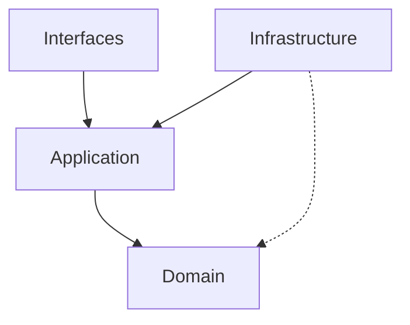

# Module Specifications

## Module Boundaries

### `src/domain`
- **Role**: Business rules, entities, value objects.
- **Forbidden**: `tokio`, `sqlx`, `reqwest`, `egui`.
- **Allowed**: `rust_decimal`, `serde`, `chrono`.

### `src/application`
- **Role**: Orchestration, agents, use cases.
- **Forbidden**: Direct database access (use repo interfaces), UI rendering.
- **Allowed**: `domain`, `tokio`, `tracing`.

### `src/infrastructure`
- **Role**: Implementation of interfaces (repositories, brokers).
- **Allowed**: Database drivers, HTTP clients, File I/O.

### `src/interfaces`
- **Role**: UI, CLI, API endpoints.
- **Allowed**: `application` (via Client), `egui`.

## Dependency Graph

## Critical Dependencies

- **`rust_decimal`**: Used everywhere. Breaking changes here break everything.
- **`tokio`**: Runtime backbone.
- **`egui`**: UI framework.
